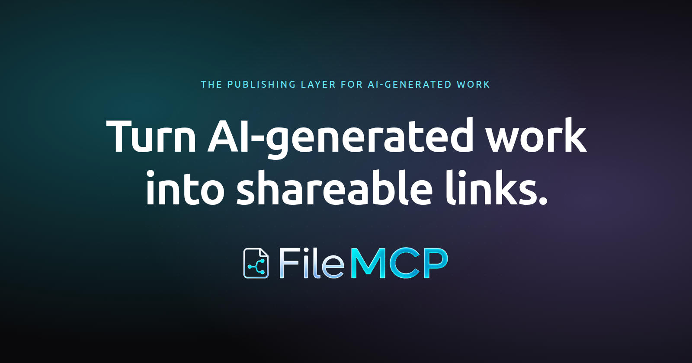

<div align="center">
  

  <h1>FileMCP</h1>
  <p><strong>The publishing layer for AI-generated work.</strong></p>

  <p>
    <a href="LICENSE"></a>
    <a href="https://github.com/filemcp/filemcp/actions"></a>
    <a href="https://github.com/filemcp/filemcp/stargazers"></a>
    <a href="https://discord.gg/filemcp"></a>
  </p>

  <p>
    <a href="https://filemcp.com">filemcp.com</a> ·
    <a href="docs/PRODUCT_SPEC.md">Product spec</a> ·
    <a href="docs/ARCHITECTURE.md">Architecture</a> ·
    <a href="docs/API_SPEC.md">API</a> ·
    <a href="docs/SELF_HOSTING.md">Self-host</a>
  </p>
</div>

---

FileMCP turns AI-generated HTML, Markdown, and JSON into shareable links your team can view, comment on, and revise. Push from `curl`, the API, or the built-in MCP server — get back a URL in seconds.

It's the loop, not just a one-way upload:

1. **Generate** — your agent creates the artifact in the conversation
2. **Publish** — one MCP/API/CLI call, get back a shareable URL
3. **Revise** — reviewers comment in the browser, your agent reads the feedback and ships v2 at the same URL

## Features

- **Browser rendering** — HTML in a sandboxed iframe, Markdown via `unified`, JSON pretty-printed, code with syntax highlighting
- **Inline comments** — Figma-style pins on rendered HTML, line-range anchors on Markdown
- **Version history** — every upload to the same slug is a new version; comments are scoped to the version they were made on
- **Stable URLs** — share once, the link keeps working as the artifact evolves
- **MCP server** — agents can `upload_asset`, `list_assets`, `get_asset`, and `read_asset_comments` directly. Fold reviewer feedback back into the conversation without copy-paste.
- **Multiple file types** — HTML, Markdown, JSON, plain text, CSS, JS, TS, SVG
- **Email-based invites** — invite teammates by email, 72-hour expiry, lazy expiration
- **Anonymous commenting** — viewers can comment without an account; optional account nudge after submit

## Quick start

### Hosted

The fastest way to try FileMCP is the hosted version at **[filemcp.com](https://filemcp.com)**. Free to start, no setup.

### Self-host

```bash
git clone https://github.com/filemcp/filemcp.git
cd filemcp
cp .env.example .env
./bb start
```

That's it. Web app at `http://localhost:3000`, API at `http://localhost:4000`. See **[docs/SELF_HOSTING.md](docs/SELF_HOSTING.md)** for production deployment, AWS SES email, and S3/Cloudflare R2 setup.

### Connect from your AI tool

Once you have an account and an API key, configure your AI client:

```bash
# Claude Code
claude mcp add --transport http filemcp https://filemcp.com/api/mcp \
  -H "Authorization: Bearer filemcp_..."

# Codex CLI
codex --mcp-server '{"name":"filemcp","url":"https://filemcp.com/api/mcp","headers":{"Authorization":"Bearer filemcp_..."}}'
```

Or upload via `curl`:

```bash
curl -X POST "https://filemcp.com/api/orgs/<your-org>/assets" \
  -H "Authorization: Bearer filemcp_..." \
  -F "file=@deck.html;type=text/html"
```

## Architecture

```
┌──────────────────────────────────────────────────┐
│  Clients                                         │
│  curl / API key  │  Nuxt Web App  │  MCP Server  │
└────────┬─────────────────┬────────────┬──────────┘
         ▼                 ▼            ▼
┌──────────────────────────────────────────────────┐
│  NestJS API                                      │
│  auth · orgs · assets · versions · comments      │
│  storage · render · thumbnail · mcp · email      │
└──────────────────────────┬───────────────────────┘
                           │
          ┌────────────────┼────────────────┐
          ▼                ▼                ▼
   ┌─────────────┐  ┌──────────────┐  ┌──────────┐
   │ PostgreSQL  │  │  S3-compat   │  │  BullMQ  │
   │ (Prisma)    │  │ (file store) │  │  (jobs)  │
   └─────────────┘  └──────────────┘  └────┬─────┘
                                           │
                                    ┌──────▼──────┐
                                    │ Worker      │
                                    │ (thumbnails)│
                                    └─────────────┘
```

Full design notes: **[docs/ARCHITECTURE.md](docs/ARCHITECTURE.md)**

## Tech stack

- **Backend** — NestJS · Prisma · PostgreSQL · BullMQ · S3-compatible storage · AWS SES
- **Frontend** — Nuxt 3 · Vue 3 · Tailwind CSS · Pinia
- **Worker** — Node + Playwright (thumbnail generation)
- **Monorepo** — pnpm workspaces (`apps/api`, `apps/web`, `apps/worker`, `packages/types`)
- **Container dev** — Docker Compose, MinIO for local S3

## Repo layout

```
filemcp/
├── apps/
│   ├── api/        # NestJS backend
│   ├── web/        # Nuxt 3 frontend
│   └── worker/     # Thumbnail generator
├── packages/
│   └── types/      # Shared TypeScript contracts
├── docs/           # Specs, architecture, deployment
└── docker-compose.{,staging,production}.yml
```

## Documentation

- **[Product spec](docs/PRODUCT_SPEC.md)** — feature scope, hypotheses, non-goals
- **[Architecture](docs/ARCHITECTURE.md)** — system design, data model, modules
- **[API spec](docs/API_SPEC.md)** — full REST + MCP reference
- **[Development](docs/DEVELOPMENT.md)** — local dev setup, common tasks
- **[Self-hosting](docs/SELF_HOSTING.md)** — Docker Compose deploy
- **[Deployment](docs/DEPLOYMENT.md)** — production notes (env, SES, S3, scaling)

## Contributing

Issues and PRs welcome. See **[CONTRIBUTING.md](CONTRIBUTING.md)** for development setup, code style, and the PR process. Be kind — see our [Code of Conduct](CODE_OF_CONDUCT.md).

For security issues please follow [SECURITY.md](SECURITY.md) — don't open a public issue.

## Community

- **Discord** — [discord.gg/filemcp](https://discord.gg/filemcp) (support, ideas, hangout)
- **Discussions** — [GitHub Discussions](https://github.com/filemcp/filemcp/discussions) (longer-form Q&A, RFCs)
- **Issues** — [GitHub Issues](https://github.com/filemcp/filemcp/issues) (bugs and feature requests)

## License

[MIT](LICENSE) © [NSpark, Inc.](https://github.com/filemcp)

The hosted version at [filemcp.com](https://filemcp.com) is operated by NSpark, Inc. The code in this repository is open source and you are free to self-host under the MIT license.
